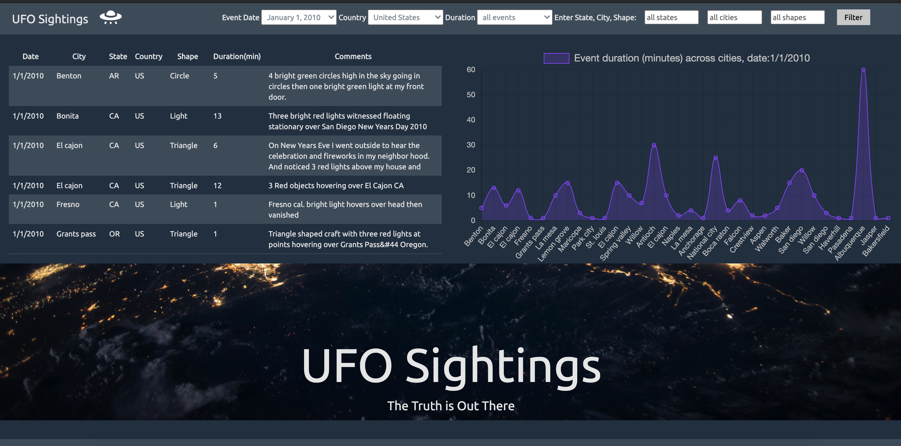

# JavaScript Challenge
* Create a table dynamically based upon a provided dataset  
* Set multiple search categories
* Render chart


[](http://commonmark.org)
[](http://hits.dwyl.com/OlegRyzhkov2020/javascript-challenge)


[](https://www.jsdelivr.com/package/npm/chart.js)

## Main Dashboard



## Data Cleaning and  Normalization

```JavaScript
//------------------------------------------------------------------------------
//Data Cleaning and Transforming
//------------------------------------------------------------------------------
for (i in tableData) {
  tableData[i].city = capitalizeFirstLetter(tableData[i].city);
  tableData[i].shape = capitalizeFirstLetter(tableData[i].shape);
  tableData[i].state = tableData[i].state.toUpperCase();
  tableData[i].country = tableData[i].country.toUpperCase();
  tableData[i].durationMinutes = duration_list[tableData[i].durationMinutes];
}

console.log(tableData);

```
## Chart.js

```JavaScript
//------------------------------------------------------------------------------
//Rendering Chart
//------------------------------------------------------------------------------
function renderChart(data, labels, label_name = 'All cities', chart_type='line') {
  console.log(data);
  console.log(labels);
  var ctx = document.getElementById('myChart').getContext('2d');
  var myChart = new Chart(ctx, {
    type: chart_type,
    data: {
      labels: labels,
      datasets: [{
        label: ("Event duration (minutes) across cities, date:"+ label_name),
        data: data,
        backgroundColor:
        'rgba(153, 102, 255, 0.2)',
        borderColor:
        'rgba(153, 102, 255, 1)',
        borderWidth: 1
      }]
    },
    options: {
      legend: {
                labels: {
                    fontColor: "#CCC",
                    fontSize: 16
                }
            },
      scales: {
        xAxes: [{ color: 'rgba(153, 102, 255, 1)',
          ticks: { fontColor: "#CCC",}}],
        yAxes: [{ color: 'rgba(153, 102, 255, 1)',
          ticks: { fontColor: "#CCC",
            beginAtZero: false,
            callback: function(value, index, values) {
                            return value;
                          }
          }
        }]
      }
    }
  });
}
```
## Contacts
[Find Me on
LinkedIn](https://www.linkedin.com/in/oleg-n-ryzhkov/)
